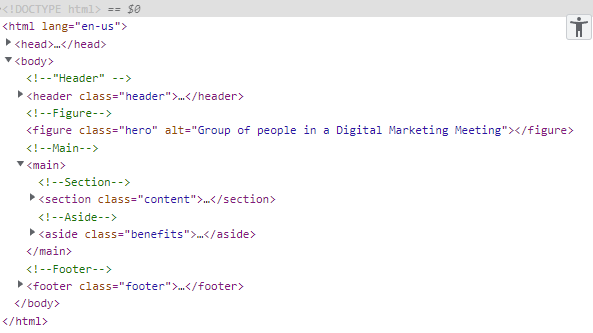

# Code Refactor Project
Code refactoring - web accessibility and codebase improvement

## Description 
This repository contains a project to improve accessibility standards for Horiseon Social Solution Services Inc. website.

## Objectives
1. Modify the actual coding in order to become more acessible when using assistive technologies.
2. To follow a logical structure and cleaner appearance
3. Resize correctly on every screen


## In order to do this, it was applied the following:

## Html

1. Title element was previously generic ("website") and it was changed to a descriptive title, under the company's name. 


2. A favicon was added to assist with browser tab navigation.

3. "Viewport" was included in the head-section, to enable the page to follow screen-width of the device being used.

````html
<meta name="viewport" content="width=device-width, initial-scale=1.0"> 

````
4. Key-words were included to help with the website's ranking in search engines:

````html
<meta name="Horiseon" content="Search Engine Optimization">
````

5. Html structure semantically upgrated with: Body, Header, Navigation, Main, Section, Article, Aside and Footer.



6. Included Alt attributes to every single image and icons:


````html

````

7. General classes were created, so elements that had the same attributes and properties could be grouped.

8. Link reference to the Home page from the logo:

````html
<a href="#home"> Hori<span class="seo">seo</span>n</a>
````


## CSS

1. Organized the CSS stylesheet following html's semantic order. Comments were also added to show where each element began and ended.

2. Repetition was eliminated by grouping the elements with the same attributes and properties under the same class name.

- class="article" - represents the following: "Search Engine Optimization", "Online Reputation Management", "Social Media Marketing" 

- class = "benefits-content" - represents the following elements: "Lead Generation", "Brand Awareness" and "Cost Management".

3. A hover attribute was included in the navigation menu to improve acessibility:


4. @media - was included so the website gets resized correctly on smaller screens. There are different set-ups for tablets and mobile.

- Position relative applied to the elements.
- Navigation: float was changed to none in smaller screens, so it becomes acessible.
- Aside bar: float changed from right to none, so it can be visualized at the bottom in smaller screens without breaking. Also margin was added so it became organized and width changed to 100% so the content's position will adjust.
- Images: height adjusted so it could fit on a smaller screens.

## Usage

With this project, the website code became cleanner, organized, accessible and easier for search engines to find the website. 

The semantic elements applied to the Html document and the "alt" attributes included on every single image and icon, increased acessibility, once screen readers are now able to read the descriptive content.

The website was also adjusted to smaller screens, using CSS @media rules, which improves acessibility and user's experience.


## Link to application: 
https://github.com/Renatatims/code_refactor

## Sources:

 - https://developer.mozilla.org/en-US/docs/Web/HTML/Element

 - https://www.w3schools.com/cssref/sel_hover.asp

 - https://www.w3schools.com/cssref/css3_pr_mediaquery.asp
 
- http://html5doctor.com/the-section-element/


